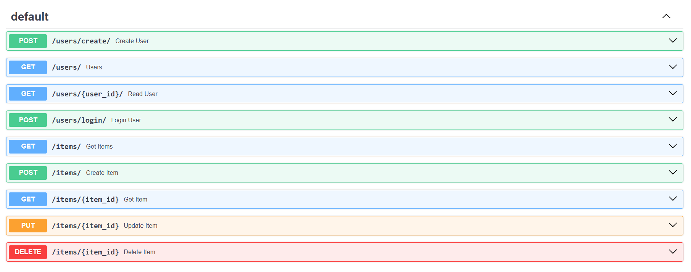
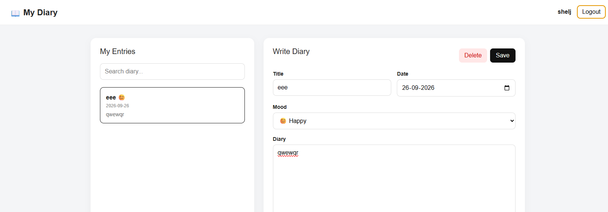
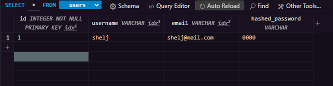
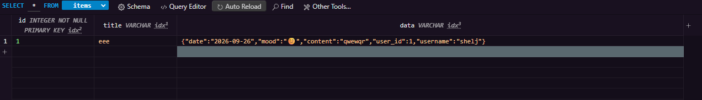

# FastAPI Template

## Only `main.py` is the total backend

This app is a api template for Login, Logout, and sample datas save and control.

## Setup

```bash
python -m venv .venv
.venv\Scripts\activate

pip install -r requirements.txt
uvicorn main:app
```

Run `http://127.0.0.1:8000/docs` to access the Swagger documentation for the API.

### Available API endpoints



## Personal Diary APP

This is a personal diary app that allows users to create, read, update, and delete diary entries. The app uses FastAPI for the backend and provides a simple interface for users to manage their diary entries.





### Diary App

Run the app and access it at `index.html` in your web browser.
